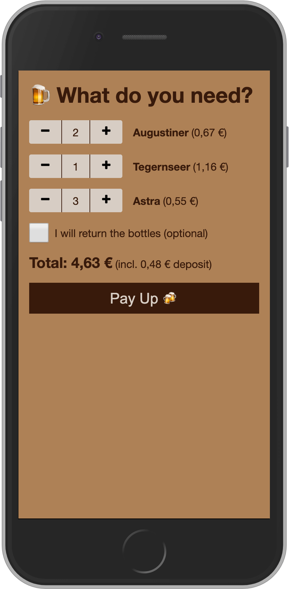

# 🍺 BeerBar - PayPal backed payment system for self-served beer bars™

A fun afternoon project to learn [Svelte](https://svelte.dev/):

The "Pay Up" button leads to PayPal.me with the receiver and amount pre-filled.

[Demo](http://sdvg.github.io/beerbar) (Please don't actually send me money 🙂)

## Development

Beer sorts and prices, deposit price and PayPal ID can be changed in `beerData.json`.  
Currency is hardcoded to Euro (for formatting and the PayPal link) but should be easy to change. 

* Serve locally: `npm run dev`
* Build: `npm run build`
